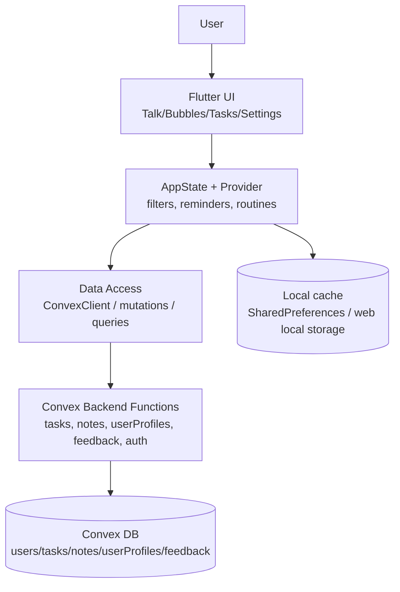
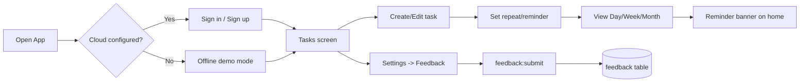

# Bubble Planner — Архитектура для Word (готовый блок)

> Скопируй этот текст в Word. Диаграммы можно вставить как код-блоки или перерисовать в SmartArt.

## 1. Короткое описание архитектуры
Bubble Planner построен по слоистой архитектуре:
1. **UI Layer (Flutter screens/widgets)**
2. **State Layer (AppState + Provider)**
3. **Data Access Layer (ConvexClient)**
4. **Backend Layer (Convex functions)**
5. **Storage Layer (Convex tables + local cache)**

Это разделение снижает связность, упрощает тестирование и ускоряет развитие продукта.

---

## 2. Диаграмма архитектуры (Mermaid)

---

## 3. Диаграмма пользовательского потока (Mermaid)

---

## 4. Таблица компонентов (вставить в Word как обычную таблицу)
| Layer | Component | Responsibility |
|---|---|---|
| UI | `TasksListTab`, `settings_sheet`, widgets | Показ экранов, ввод пользователя |
| State | `AppState` | Бизнес-логика, фильтры, локальное состояние |
| Data access | `ConvexClient` calls | Вызов мутаций/запросов |
| Backend | `convex/tasks.ts`, `notes.ts`, `feedback.ts` | Серверные операции и валидация |
| Storage | Convex tables + local cache | Долговременное хранение данных |

---

## 5. Готовая подпись для слайда “Architecture”
**Bubble Planner Architecture:**
Flutter UI communicates with centralized AppState, which orchestrates local cache and cloud operations through ConvexClient. Business operations are implemented as Convex functions and persisted in structured tables, including a dedicated `feedback` table for centralized user input collection.

---

## 6. Какие картинки вставить в Word (список)
1. Screenshot главного экрана.
2. Screenshot вкладки Tasks (Day/Week/Month + filters).
3. Screenshot quick actions (`...` menu).
4. Screenshot Feedback tab.
5. Архитектурная схема (можно из Mermaid или draw.io).
6. User flow схема.

---

## 7. Промпты для генерации картинок (когда включим image model)
- **Architecture image prompt:**
  "Clean architecture diagram for Bubble Planner app with layers: UI, AppState, Data Access, Convex Backend, Convex DB and Local cache, white background, modern flat style, presentation-ready."

- **User flow image prompt:**
  "User flow infographic for Bubble Planner: login/offline mode, tasks create/edit, repeat/reminder, day-week-month view, feedback submit to cloud table, clean corporate style."
